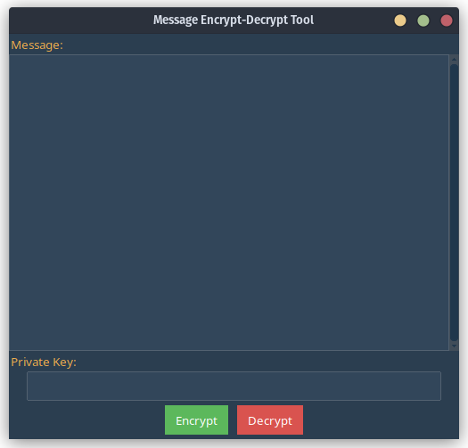

# Message Encrypt-Decrypt Tool 🔒

A simple yet effective graphical user interface tool for encrypting and decrypting messages. Utilizes AES cipher in CBC mode to ensure top-notch security. Comes with key derivation, password complexity checks, and a user-friendly interface.



## 🌟 Features
- **AES encryption** in CBC mode.
- **Key derivation** using PBKDF2HMAC with SHA256.
- **Password complexity checks** to ensure message confidentiality.
- **User-friendly graphical interface**.
- **Copy-to-clipboard** functionality for easily sharing encrypted messages.

## 💽 Installation & Usage

1. **Clone the Repository**

    ```bash
    git clone https://github.com/egeland00/Encrypt-Message.git
    cd Encrypt-Message
    ```

2. **Install the Required Libraries**

    ```bash
    pip install -r requirements.txt
    ```

3. **Run the Application**

    ```bash
    python gui.py
    ```

## 🛡️ Password Requirements

To ensure the security of your encrypted messages, your password must adhere to the following criteria:
- Minimum of **8 characters** in length.
- Contains at least:
  - **One lowercase letter**.
  - **One uppercase letter**.
  - **One digit**.
  - **One special character**.

## 🤝 Contributing

Pull requests are welcome! For major changes, please open an issue first to discuss what you'd like to change.

## 📜 License

This project is licensed under the MIT License.
